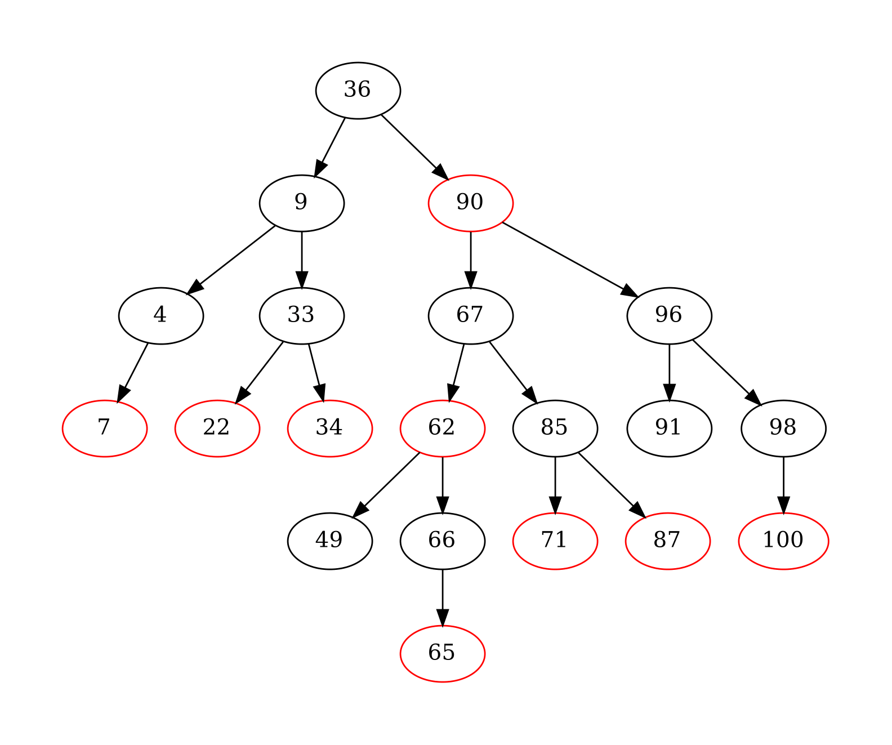

# Red-black tree implementation

This Python module provides an implementation of a multiset (and set) using a red-black tree data structure. The implementation is based on the description provided in 'Introduction to Algorithms' by Cormen et al. (4th edition). It also contains a traditional, unbalanced binary tree implementation, with the same functionality.

## Usage

To use the `MultiRedBlackTree` class, import it from the module:

```python
from MultiRedBlackTree import MultiRedBlackTree
```

### Initialization

You can create a new red-black tree by instantiating the `MultiRedBlackTree` class. If you have a collection of elements, you can pass it as an iterable during initialization:

```python
# Creating an empty tree
tree = MultiRedBlackTree()

# Initializing with a collection of elements
elements = [1, 3, 5, 2, 4]
tree_with_elements = MultiRedBlackTree(elements)
```

### Adding Elements

You can add elements to the tree using the `add` method:

```python
tree.add(6)
```

In the multiset implementation, it will still add a value if it is already present, thus it can also be removed multiple times, and `.count(value)` works as expected. In the single set version, however, adding a duplicate value will do nothing.

### Removing Elements

To remove elements, use the `remove` method.

```python
tree.remove(5)
```

If the value is not present, the method will raise a `ValueError` exception to inform the failure. However, it will not alter the tree in any way, thus the error can simply be catched and the tree is still usable after this.

### Visualization

You can generate a visualization of the red-black tree using the `draw` method. The argument `view_nil` specifies if the `NIL` node should be rendered, defaults to false. This generates a PDF file with a graphical representation of the tree:

```python
tree.draw(name="tree_visualization", view_nil=False)
```




### Contains

To see if a value is contained in a tree, just use the `in` keyword.

### Iteration

The tree supports iteration in ascending order:

```python
for element in tree:
    print(element)
```

### Red-Black Tree Validation

You can check if the tree adheres to the properties of a red-black tree using the `is_red_black` method:

```python
valid_tree = tree.is_red_black()
print(valid_tree)  # True or False
```

### Additional Methods

The module provides methods such as `lower_bound`, `upper_bound`, and others. Refer to the source code or documentation for detailed information on these methods.
